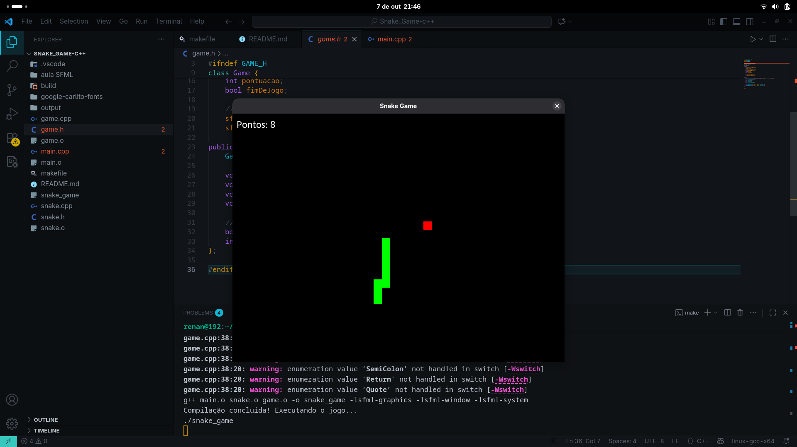

Perfeito! Vou organizar seu arquivo em um **README.md bonito, limpo e bem estruturado**, com seções claras, blocos de código e tabelas, pronto para GitHub. Aqui está a versão formatada:

---

````markdown
# 🐍 Snake Game - UFSCar AED1

---

## 🎮 Sobre o Projeto

Este é o clássico jogo da cobrinha, recriado em **C++** usando a biblioteca gráfica **SFML**!  
O objetivo é simples: comer as frutinhas, crescer o máximo possível e tentar não se enrolar (literalmente 😄).

Desenvolvido como parte da Fase 1 do projeto da faculdade, para treinar lógica de programação, estruturas de dados e manipulação gráfica.

---

## ✨ Características do Jogo

- 🎯 Movimento suave usando as setas do teclado  
- 📊 Contador de pontuação que aumenta a cada fruta comida  
- ⚠️ Sistema de fim de jogo ao bater nas bordas ou no próprio corpo  
- 🐍 Cobrinha que cresce infinitamente (até você errar!)  
- 🎨 Interface gráfica moderna e responsiva  
- 🏆 Sistema de recordes implícito (tente bater seu próprio recorde!)

---

## 🚀 Como Jogar

### Pré-requisitos

- **Sistema Operacional:** Linux (testado no Fedora)  
- **Compilador:** GCC/G++  
- **Bibliotecas:** SFML 2.5+

### Instalação e Execução

1. Clone o repositório:

```bash
git clone https://github.com/renan-michelao/Snake-Game-fueda
cd Snake-Game_fueda
````

2. Instale as dependências (Fedora):

```bash
sudo dnf install SFML-devel gcc-c++ make
```

3. Compile e execute o jogo:

```bash
make
```

> O comando `make` irá compilar automaticamente e executar o jogo!

---

## 🎯 Controles do Jogo

| Tecla                 | Ação                |
| --------------------- | ------------------- |
| ⬆️ Seta Para Cima     | Mover para cima     |
| ⬇️ Seta Para Baixo    | Mover para baixo    |
| ➡️ Seta Para Direita  | Mover para direita  |
| ⬅️ Seta Para Esquerda | Mover para esquerda |
| ❌ Fechar Janela       | Sair do jogo        |

---

## 🏗️ Estrutura do Projeto

```
Snake-Game/fueda/
├── main.cpp                 # Arquivo principal
├── snake.h                  # Cabeçalho da classe Snake
├── snake.cpp                # Implementação da cobra
├── game.h                   # Cabeçalho da classe Game
├── game.cpp                 # Implementação do jogo
├── Makefile                 # Sistema de build
├── README.md                # Este arquivo
└── google-carlito-fonts/
    └── Carlito-Regular.ttf  # Fonte do jogo
```

---

## 🛠️ Comandos Make Disponíveis

| Comando              | Descrição                              |
| -------------------- | -------------------------------------- |
| `make` ou `make run` | Compila e executa o jogo (recomendado) |
| `make build`         | Apenas compila sem executar            |
| `make clean`         | Remove arquivos compilados             |
| `make rebuild`       | Recompila tudo do zero e executa       |
| `make help`          | Mostra ajuda dos comandos              |

---

## 🎯 Regras do Jogo

* 🎯 **Objetivo:** Coma o máximo de frutas vermelhas possível
* 🎮 **Movimento:** Use as setas para controlar a direção da cobra
* 📈 **Crescimento:** Cada fruta comida aumenta o tamanho da cobra em 1 segmento
* 💀 **Game Over:** O jogo termina se você:

  * Bater nas paredes (bordas da tela)
  * Colidir com o próprio corpo
* 🏆 **Pontuação:** Cada fruta vale 1 ponto

---

## 🔧 Tecnologias Utilizadas

| Tecnologia | Versão | Uso                 |
| ---------- | ------ | ------------------- |
| C++        | 17     | Linguagem principal |
| SFML       | 2.5.1  | Biblioteca gráfica  |
| Make       | -      | Sistema de build    |

---

## 📚 Conceitos de AED Aplicados

* 📊 Estruturas de Dados: `std::vector` para representar a cobra (Estrutura de Fila)
* ⚙️ Algoritmos: Movimentação, detecção de colisões, geração aleatória
* 🏛️ Orientação a Objetos: Classes `Snake` e `Game`
* 🔒 Encapsulamento: Métodos públicos para controle da cobra (usando os botões da TV)

---

## 🐛 Solução de Problemas

**Erro: bibliotecas SFML não encontradas**

```bash
sudo dnf reinstall SFML-devel
```

**Erro de compilação**

```bash
make rebuild
```

**Permissão negada**

```bash
chmod +x snake_game
```

---

## 👨‍💻 Desenvolvimento

| Item                                                                                                        | Detalhes                                    |
| ----------------------------------------------------------------------------------------------------------- | ------------------------------------------- |
| Disciplina                                                                                                  | Algoritmos e Estruturas de Dados I (AED1)   |
| Instituição                                                                                                 | Universidade Federal de São Carlos (UFSCar) |
| Desenvolvedores                                                                                             |                                             |
| Renan Cavalcanti Michelão - 845578: Responsável pela implementação do jogo (main)                           |                                             |
| Miguel Leal Landi - 847792: Responsável pelo cabeçalho do jogo                                              |                                             |
| Mateus Alves da Silva Dias - 847942: Responsável pela estrutura, compilação e informações do projeto        |                                             |
| Gabriel Ribeiro Almeida do Carmo - 845242: Responsável pela ideia e lógica do jogo e ajuda na implementação |                                             |

> Para futuras features, planejamos deixar o projeto mais agradável visualmente e talvez implementar modos de jogo diferentes.

---

## 🎯 Mensagem Final

🎮 Bom jogo e boa sorte batendo seu recorde! 🐍

*"Programar é como fazer mágica, mas com mais Ctrl+Z e menos varinhas"* ✨

```
<div align="center">


*Snake Game em execução - Desenvolvido para AED1/UFSCar*

</div>


---


